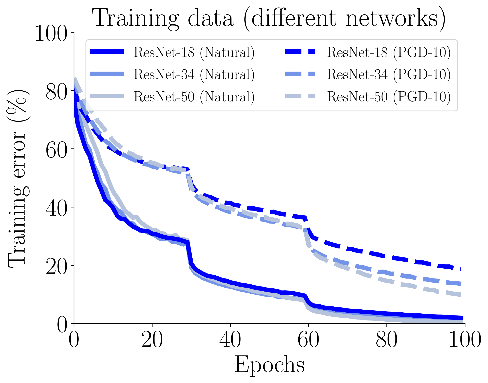

# Geometry-aware Instance-reweighted Adversarial Training

This repository provides codes for geometry-aware instance-reweighted adversarial training methods,
based on the paper **Geometry-aware Instance-reweighted Adversarial Training** 
(https://arxiv.org/abs/2010.01736) <br/>
*Jingfeng Zhang, Jianing Zhu, Gang Niu, Bo Han, Masashi Sugiyama and Mohan Kankanhalli*

## What is the nature of adversarial training?
Adversarial training employs adversarial data for updating the models. 
For more details of the nature of adversarial training, refer to this [FAT's GitHub](https://github.com/zjfheart/Friendly-Adversarial-Training) for the preliminary. <br/> 
In this repo, you will know: 
## FACT 1: Model Capacity is NOT enough for adversarial training.
<p align="center">
    
   
</p>
<p align="left">
We plot standard training error (Natural) and adversarial training error (PGD-10) over the training epochs of the standard AT (Madry's) on CIFAR-10 dataset. 
  *Left panel*: AT on different sizes of network. 
  *Right panel*: AT on ResNet-18 under different perturbation bounds eps_train. </p>
  
  
Refer to [FAT's GitHub](https://github.com/zjfheart/Friendly-Adversarial-Training) for the standard AT by setting 

```python FAT.py --epsilon 0.031 --net 'resnet18' --tau 10 --dynamictau False``` 

OR using codes in this repo by setting

```python GAIRAT.py --epsilon 0.031 --net 'resnet18' --Lambda 'inf'``` 

to recover the standard AT (Madry's).


The over-parameterized models that fit nataral data entirely in the standard training are still far from enough for fitting adversarial data in adversarial training.
Compared with standard training fitting the natural data points, adversarial training smooths the neighborhoods of natural data, so that adversarial data consume significantly more model capacity than natural data. 

The volume of this neighborhood is exponentially  large w.r.t. the input dimension , even if  is small.

Under the computational budget of 100 epochs, the networks hardly reach zero error on the adversarial training data.


## FACT 2: Data points are inherently different. 
More attackable data are closer to the decision boundary.

More guarded data are farther away from the decision boundary.

<p align="center">
    
    
</p>
<p align="left">
More attackable data (lighter red and blue) are closer to the decision boundary; more guarded data (darker red and blue) are farther away from the decision boundary. *Left panel*: Two toy examples. *Right panel*: The model’s output distribution of two randomly selected classes from the CIFAR-10 dataset. The degree of robustness (denoted by the color gradient) of a data point is calculated based on the least number of iterations κ that PGD needs to find its misclassified adversarial variant. </p>


## Therefore, given the limited model capacity, we should treat data differently for updating the model in adversarial training.
**IDEA**: Geometrically speaking, a natural data point closer to/farther from the class boundary is less/more robust, and the corresponding adversarial data point should be assigned with larger/smaller weight for updating the model.<br/>
To implement the idea, we propose geometry-aware instance-reweighted adversarial training (GAIRAT), where the weights are based on how difficult it is to attack a natural data point.<br/>
"how difficult it is to attack a natural data point" is approximated by the number of PGD steps that the PGD method requires to generate its misclassified adversarial variant.
<p align="center">
    
</p>
<p align="left">
The illustration of GAIRAT. GAIRAT explicitly gives larger weights on the losses of adversarial data (larger red), whose natural counterparts are closer to the decision boundary (lighter blue). GAIRAT explicitly gives smaller weights on the losses of adversarial data (smaller red), whose natural counterparts are farther away from the decision boundary (darker blue). </p>

## GAIRAT's Implementation
For updating the model, GAIRAT assigns instance dependent weight (```reweight```) on the loss of the adversarial data (found in ```GAIR.py```). <br/>
The instance dependent weight depends on ```num_steps```, which indicates the least PGD step numbers needed for the misclassified adversarial variant. <br/>


## Preferred Prerequisites

* Python (3.6)
* Pytorch (1.2.0)
* CUDA
* numpy

## Running GAIRAT, GAIR-FAT on benchmark datasets  (CIFAR-10 and SVHN)
(To be updated)

Here are examples:

* Train GAIRAT and GAIR-FAT on WRN-32-10 model on CIFAR-10 and compare our results with [AT](https://arxiv.org/abs/1706.06083), [FAT](https://arxiv.org/abs/2002.11242)
```bash
CUDA_VISIBLE_DEVICES='0' python GARAT.py 
CUDA_VISIBLE_DEVICES='0' python GART_FAT.py 
```
* How to recover the original FAT and AT using our code? 

```bash
CUDA_VISIBLE_DEVICES='0' python GARAT.py --Lambda 'inf' --output_dir './AT_results' 
CUDA_VISIBLE_DEVICES='0' python GART_FAT.py --Lambda 'inf' --output_dir './FAT_results' 
```

* Evaluations
After running, you can find ```./GAIRAT_result/log_results.txt``` and ```./GAIR_FAT_result/log_results.txt``` for checking Natural Acc. and PGD-20 test Acc. <br/>
We also evaluate our models using PGD+. PGD+ is the same as ``PGD_ours`` in [RST repo](https://github.com/yaircarmon/semisup-adv)
Since PGD+ is computational defense, we only evaluate the best checkpoint ```bestpoint.pth.tar``` and the last checkpoint ```checkpoint.pth.tar``` in the folders ```GAIRAT_result``` and ```GAIR_FAT_result``` respectively. 
```bash
CUDA_VISIBLE_DEVICES='0' python eval_PGD_plus.py --model './GAIRAT_result/bestpoint.pth.tar'
CUDA_VISIBLE_DEVICES='0' python GART_FAT.py --model './GAIR_FAT_result/bestpoint.pth.tar'
```

### White-box evaluations on WRN-32-10

 Defense              	| Natural Acc. 	| PGD-20 Acc. | PGD+ Acc. | 
|-----------------------|-----------------------|------------------|-----------------|
|[AT(Madry)](https://arxiv.org/abs/1706.06083)		| 00.00%	|  00.00%	|     00.00%	    |
| [FAT](https://arxiv.org/abs/2002.11242)  		|  00.00%  	|     00.00%      |     00.00%     |
| GAIRAT  |  **00.00**0.221%   	|00.000.355%| 46.130.049%|
| GAIR-FAT		|  00.00%   	|   00.00%   		|     00.00%    	|

## Benchmarking robustness with additional 500K unlabeled data on CIFAR-10 dataset.

In this repo, we unleash the full power of our geometry-aware instance-reweighted methods by incorporating 500K unlabeled data (i.e., **GAIR-RST**). 
In terms of both evaluation metrics, i.e., generalization and robustness, we can obtain the best WRN-28-10 model among all public available robust models. <br/>

* How to create the such the superior model from scratch? 
1. Download ```ti_500K_pseudo_labeled.pickle``` containing our 500K pseudo-labeled TinyImages from this [link](https://drive.google.com/file/d/1LTw3Sb5QoiCCN-6Y5PEKkq9C9W60w-Hi/view) (Auxillary data provided by Carmon et al. 2019). Store ```ti_500K_pseudo_labeled.pickle``` into the folder ```./data```<br/>
2. You may need mutilple GPUs for running this. 
```bash
chmod +x ./GAIR_RST/run_training.sh
./GAIR_RST/run_training.sh
```
3. We evaluate the robust model using natural test accuracy on natural test data and roubust test accuracy by [Auto Attack](https://github.com/fra31/auto-attack). 
Auto Attack is combination of two white box attacks and two black box attacks. 
```bash
chmod +x ./GAIR_RST/autoattack/examples/run_training.sh
```

### White-box evaluations on WRN-28-10

 Defense              	| Natural Acc. 	| AA Acc. |
|-----------------------|-----------------------|------------------|
| [RST](https://arxiv.org/abs/1905.13736)  		|  89.69%  	|     59.53%      |
|[MART](https://openreview.net/forum?id=rklOg6EFwS)		|87.50%	|  56.29%	| 
| [AT-AWP](https://arxiv.org/abs/2004.05884)  |  88.25   	|60.04%| 
| GAIR-RST		|  **89.80%**   	|   **60.90%**   		|


### Wanna download our superior model for other purposes? Sure! 

We welcome various attack methods to attack our defense models. For cifar-10 dataset, we normalize all images into ```[0,1]```. <br/>

Download our pretrained models ```checkpoint-epoch200.pt``` into the folder ``./GAIR_RST/GARR_RST_results`` through this [Google Drive link](https://drive.google.com/drive/folders/1Ry7q_NbCgeJsjSwxXpRfi1zSc_jdVJf6?usp=sharing).

You can evaluate this pretrained model through ```./GAIR_RST/autoattack/examples/run.sh```

## Reference
```
@article{zhang2020geometry,
  title={Geometry-aware Instance-reweighted Adversarial Training},
  author={Zhang, Jingfeng and Zhu, Jianing and Niu, Gang and Han, Bo and Sugiyama, Masashi and Kankanhalli, Mohan},
  journal={arXiv:2010.01736},
  year={2020}
}
```

# Contact
Please contact j-zhang@comp.nus.edu.sg and zhujianing9810@gmail.com if you have any question on the codes.

